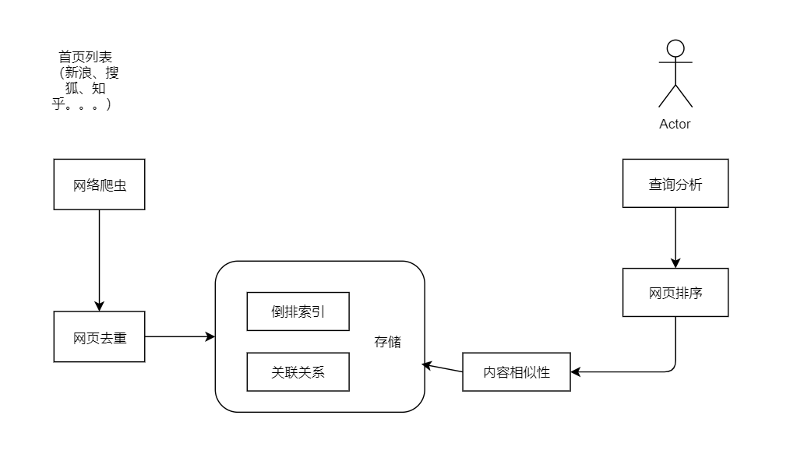
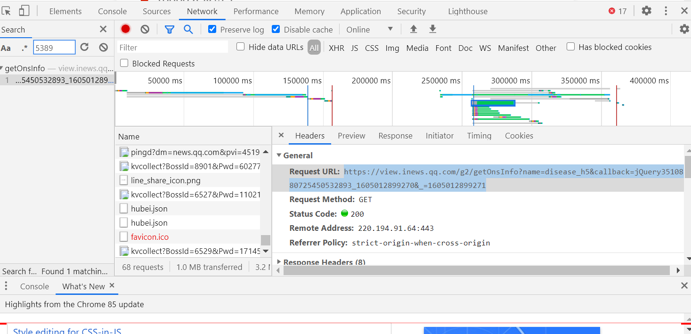
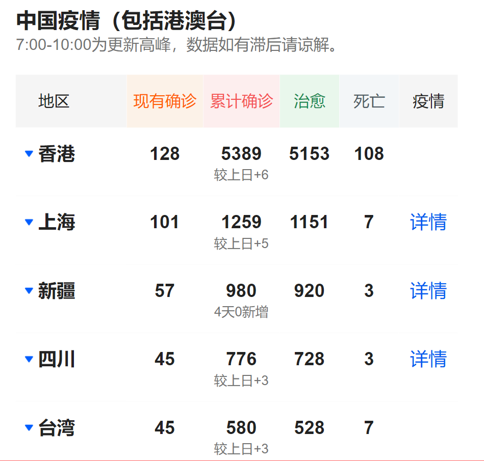
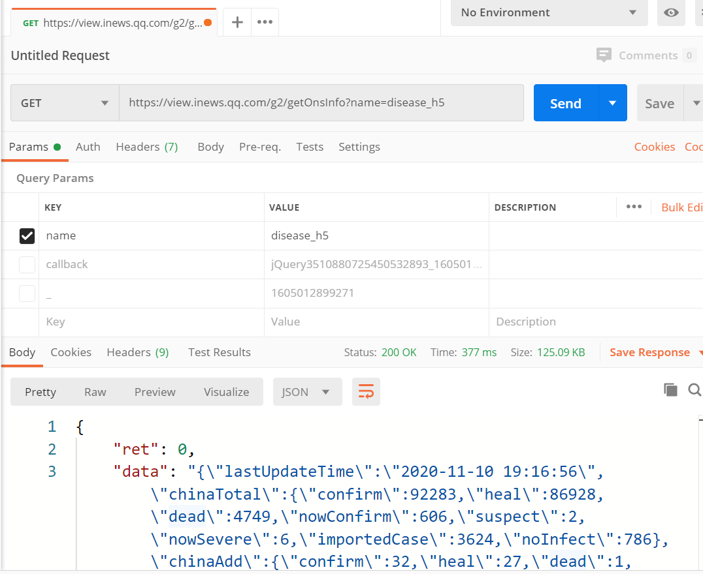

# SpringBoot实战项目笔记

## Day 1

目标：
贴合实战的业务功能
爬虫的底层原理
springboot的技术整合

项目的诞生：
项目发起人/总负责人：项目经理 PM
产品经理PD、UI设计师 UED、前端工程师 FE、
后端工程师RD、测试工程师QA、运维工程师 OP

爬虫  
搜索引擎做的事儿，链接人和内容
爬虫： 网页爬取 -- 网页去重 -- 网页解析  -- 内容保存（倒排索引）

通用型爬虫——非定向数据 （搜索引擎使用）
垂直型爬虫——定向数据
验证码是防爬虫的重要手段

验证码是防爬虫的重要手段

## Day2 

## （一）获取数据

爬取方式分析：

https://news.qq.com/zt2020/page/feiyan.htm#/?nojump=1

chrome的控制台

注意  选中 Preserve log 选项

目标：找到并获取表格数据

可以通过搜索  特别的数据  如5389  找到对应的请求地址

https://view.inews.qq.com/g2/getOnsInfo?name=disease_h5&callback=jQuery3510880725450532893_1605012899270&_=1605012899271

需要是用postman来验证， 排除浏览器附加的cookie及其他参数后，能不能返回需要的数据

拷贝出数据   在idea中进行格式化处理

替换 Ctrl+R    格式化 Ctrl+Alt+L

## （二）解析数据

json数据   -》   自定义的格式

fastjson    gson

JSON = JavaScript  Object Notation    （JavaScript的对象表示法）

优点：独立于语言，具备自我描述性，轻量

| Json          | Java    |
| ------------- | ------- |
| String        | String  |
| Number        | Number  |
| true \| false | Boolean |
| null          | null    |
| array         | List    |
| object        | Map     |

将对象转成json字符串  toJson(Object obj)

将json字符串转成对象  fromJson(String jsonStr, T.class)

分析丁香医生网站的数据

https://ncov.dxy.cn/ncovh5/view/pneumonia

返回的数据格式是html页面

Jsoup  —  Java的html解析器

Document  doc = Jsoup.parse(htmlStr);

Document  doc1 = Jsoup.connect(urlStr).get();

提供了一种查找方式   能够快速定位到某个标签

Ducument由Element元素构成

doc.getElementById("content")

doc.getElementsByTag("a")

doc.select("a[href]")

doc.select("img[src$=.png]")

addClass();
removeAttr();
val("");

val("");

优点：
1）从一个URL 解析出Html , 内嵌了http请求过程
2）使用DOM 或 CSS选择器来查找、取出数据
3）可以增删html的元素、属性、文本等。

数据源备份

转为实时数据

如何用java模拟http请求？

使用HttpURLConnection (原生的)    HttpClient的jar包是最常用的

