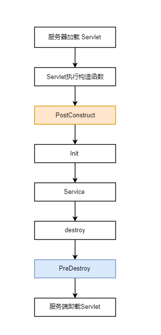

# SpringBoot实战项目笔记


## Day 1

目标：
贴合实战的业务功能
爬虫的底层原理
springboot的技术整合


项目的诞生：
项目发起人/总负责人：项目经理 PM
产品经理PD、UI设计师 UED、前端工程师 FE、
后端工程师RD、测试工程师QA、运维工程师 OP


爬虫  
搜索引擎做的事儿，链接人和内容
爬虫： 网页爬取 -- 网页去重 -- 网页解析  -- 内容保存（倒排索引）


通用型爬虫——非定向数据 （搜索引擎使用）
垂直型爬虫——定向数据
验证码是防爬虫的重要手段


验证码是防爬虫的重要手段


## Day2 


## （一）获取数据

爬取方式分析：

https://news.qq.com/zt2020/page/feiyan.htm#/?nojump=1


chrome的控制台


注意  选中 Preserve log 选项


目标：找到并获取表格数据


可以通过搜索  特别的数据  如5389  找到对应的请求地址

https://view.inews.qq.com/g2/getOnsInfo?name=disease_h5&callback=jQuery3510880725450532893_1605012899270&_=1605012899271


需要是用postman来验证， 排除浏览器附加的cookie及其他参数后，能不能返回需要的数据


拷贝出数据   在idea中进行格式化处理

替换 Ctrl+R    格式化 Ctrl+Alt+L


## Day 3

## （二）解析数据

#### 1、JSON格式

json数据   -》   自定义的格式

fastjson    gson


JSON = JavaScript  Object Notation    （JavaScript的对象表示法）

优点：独立于语言，具备自我描述性，轻量

| Json          | Java    |
| ------------- | ------- |
| String        | String  |
| Number        | Number  |
| true \| false | Boolean |
| null          | null    |
| array         | List    |
| object        | Map     |


将对象转成json字符串  toJson(Object obj)

将json字符串转成对象  fromJson(String jsonStr, T.class)


#### 2、HTML格式


分析丁香医生网站的数据，返回的数据格式是html页面

https://ncov.dxy.cn/ncovh5/view/pneumonia


Jsoup  —  Java的html解析器

使用方式：

Document  doc = Jsoup.parse(htmlStr);

Document  doc1 = Jsoup.connect(urlStr).get();

提供了一种查找方式   能够快速定位到某个标签


Ducument由Element元素构成，可以使用getElementById()方法、getElementsByTag()方法等


优点：
1）从一个URL 解析出Html , 内嵌了http请求过程
2）使用DOM 或 CSS选择器来查找、取出数据
3）可以增删html的元素、属性、文本等。


## Day 4

逻辑思路

1）通过分析，拿到要展示的数据，存储到tmp.json文件中
2）定义数据格式 DataBean
3）DataController ->  DataService ->  DataHandler（数据处理端）
4）list.html页面，将数据通过thymeleaf渲染


将固定数据转为实时数据，方式——用java来模拟http请求

1) 使用HttpURLConnection (原生的)    
2) HttpClient的jar包是最常用的


作业： 通过不同的请求参数，访问不同的数据源（腾讯新闻、丁香医生）


## Day 5

将数据存储起来，并定时更新

1）依赖引入，mybatis-spring-boot-starter   mybatis-plus  mysql-connector-java
2）数据库配置，url、driver-class、username、password
3）增加Mapper    DataMapper extends BaseMapper   
4）更改主程序入口类增加注解   @MapperScan("com.duing.mapper")
5）让Service能够调用到Mapper
              DataService  extends IService\<DataBean>
              DataServiceImpl extends ServiceImpl<DataMapper, DataBean>
6)   Bean的修改

​              实现序列化、要有无参的构造器、对应一个具体的表   

```
@NoArgsConstructor
@TableName("illness")
public class DataBean implements Serializable {
```

​      

初始化数据
1） 将DataHandler增加注解@Component
2） 服务器启动时执行

```
    @PostConstruct
    public void saveData() {
        System.out.println("初始化数据的存储");
        List<DataBean> dataBeans = getData();

        // 先清空 再存储
        dataService.remove(null);
        dataService.saveBatch(dataBeans);
    }

```





定时更新数据
1）在主程序入口中，打开开关@EnableScheduling
2）在方法中设置定时时效  @Scheduled(cron = "0 0/1 * * * ? ")


cron表达式

| 字段 | 范围 | 字符    |
| ---- | ---- | ------- |
| 秒   | 0-59 | * / - , |
| 分钟 | 0-59 |         |
| 小时 | 0-23 |         |
| 日期 | 1-31 | L W C   |
| 月份 | 1-12 |         |
| 星期 | 1-7  |         |

```
*  任意  - 区间  , 枚举  L 最后  W 工作日
```


 @Scheduled

1）固定频率任务

比如  每10s执行一次

对于 方法A()   自身执行了12s   下一次的执行时间为12s

 @Scheduled(fixedRate = 10000)

2）固定间隔任务

比如 每10s执行一次

对于 方法A()  自身执行了12s   下一次的执行时间为22s

 @Scheduled(fixedDelay = 10000)


下周的内容：

数据可视化 echarts、 国际化、 邮件、登录、AOP


## Day 6 & Day 7

数据可视化 echarts

1）官网 -  Demo示例
2）确认数据格式
3）确认数据来源，进行格式转化

编写代码的思路：

1）比如折线图  graph.html 、柱状图  graphBar.html 、地图 map.html的实例

地图的参考实例
https://echarts.apache.org/examples/zh/editor.html?c=doc-example/map-example

2）分析腾讯新闻的数据来源     GraphHandler
3）编写请求入口，返回渲染页面  GraphController ->  GraphHandler
         使用的js资源  放到了static文件夹下     动态页面放入templates文件夹下


作业： 把所有图像和列表  整合到一个界面中   越接近腾讯新闻越好


## Day 8 

国际化 （切换多语种）

1）变换语种对应的文本，哪些要变化（配置文件配置）
2）list.properties   声明key和value ，会默认显示出来，注意编码格式
3）list_zh_CN.properties 和   list_en_US.properties，都存放到 i18n 文件夹下
4）在application配置里，增加spring.messages.basename=i18n.list  
      (list代表默认使用的文件名)
5）改造html文件，原来的静态显示，增加动态渲染
6）通过浏览器对语言的设置，进行网页中英文的切换
      Chrome为例   【设置】-【高级】-【语言】  将英语（美国）指定
      原理是，根据http请求中 Accept-Language参数的不同，进行的切换处理
7）还可以增加中英文切换按钮，比如

```
<label>
    <a class="btn btn-sm" th:href="@{/(lan='zh_CN')}">中文</a>
    <a class="btn btn-sm" th:href="@{/(lan='en_US')}">英文</a>
</label>
```


自定义处理器

```
public class MyLocaleResolver implements LocaleResolver {

    @Override
    public Locale resolveLocale(HttpServletRequest httpServletRequest) {
        String lan = httpServletRequest.getParameter("lan");
        Locale locale = Locale.getDefault();
        if (!StringUtils.isEmpty(lan)) {
            String[] split = lan.split("_");
            locale = new Locale(split[0], split[1]);
        }

        return locale;
    }

    @Override
    public void setLocale(HttpServletRequest httpServletRequest,
                          HttpServletResponse httpServletResponse, Locale locale) {

    }
}
```


注入spring

```
@Configuration
public class MyConfig {

    @Bean
    public LocaleResolver localeResolver() {
        return new MyLocaleResolver();
    }
}

```


## Day 9

邮件处理的核心流程


以qq邮箱  发送邮件给  126邮箱为例：

常用电子邮件协议， SMTP、POP3、IMAP

SMTP = Simple Mail Transfer Protocol   简单邮件传输协议


